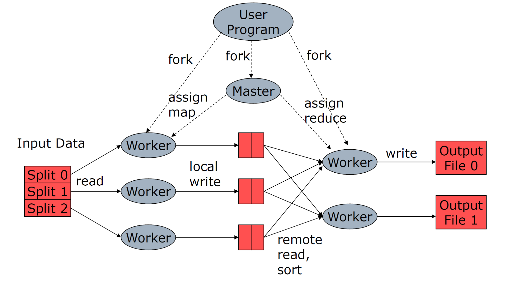
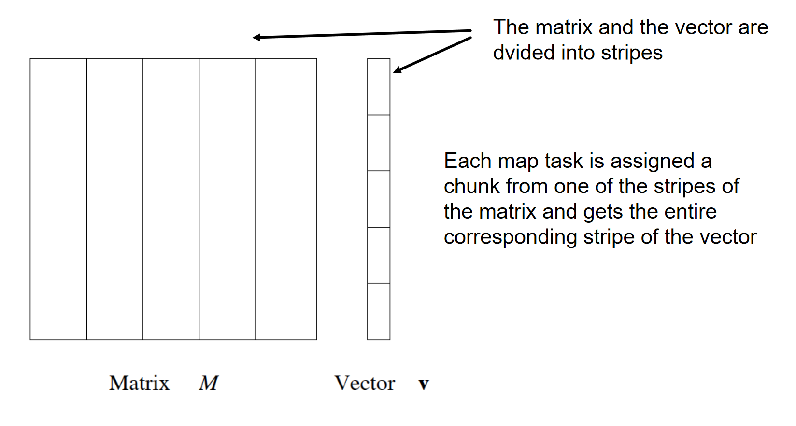

# Hadoop

Hadoop è un framework opensource (progetto Apache, sviluppato da Yahoo). Lo scopo di Hadoop è quello di immagazzinare e processare dataset in scala massiva. Hadoop può girare su un cluster di [comodity hardware](https://susedefines.suse.com/definition/commodity-hardware/). Le seguenti componenti formano il core del framework: 

* **HDFS**, un file system distribuito
* **MapReduce**, modello di programmazione per large scale data processing. 

Hadoop astrae la complessità dietro i sistemi distribuiti, permettendo a programmatori senza alcuna competenza nel campo di poter utilizzare facilmente le risorse di un data center per elaborare grandi moli di dati. 


## Large scale computing

Per processare grandi moli di dati vi sono due tecniche: 

* Scale up: aumentare le prestazioni di un singolo nodo
* Scale out: aumentare il numero di nodi

Nella maggior parte dei casi conviene adottare la seconda tecnica: si utilizza un cluster formato da **commodity hardware**, ovvero hardware economico, facilmente reperibile, e si organizza il computing dei dati in modo parallelo. Con lo scale out è necessario organizzare il processing dei dati in maniera distribuita, quindi orchestrare i nodi, adottare tecniche di fault tolerance nel caso di guasti, trasportare i dati da un nodo ad un altro etc. 

Hadoop risolve elegantemente questi problemi: 

* Provvede un file system distribuito, astraendo le complicazioni sottostanti e permettendo al programmatore di accedere ai dati come in un normale file system. 
* Introduce un modello di programmazione orientata al calcolo distribuito, ovvero Map-Reduce. 


## Concetti chiave

L'infrastruttura dello storage **HDFS** è formata da:

* **Datanode**, nodi che contengono e trasferiscono dati
* **Namenode**, localizza i file nei datanode (orchestratore)

I file sono divisi in blocchi e replicati sui datanode (replicazione spesso su diversi rack). Chunk da 16-64 mb vengono inviati ai workers per la computazione. L'utente può scegliere il grado di replicazione e la dimensione dei chunk.

L'infrastruttura della componente **MapReduce** è la seguente: 

* **Masternode**, che orchestra la computazione
* **Workers**, effettuano la computazione

Ogni programma che gira su Hadoop rispetta la seguente pipeline (modello MapReduce): 

* iterare su un grande numero di record **in parallelo**
* Ad ogni iterazione, estrarre delle informazioni 
* Eseguire uno shuffling ed un sorting dei risultati intermedi 
* Aggregare i risultati intermedi
* Generare il risultato finale

Vi sono due sole primitive:

* La **map** prende in input un oggetto $(k,v)$ con una chiave $k$ ed un valore $v$ e restituisce un elenco di coppie chiave valore $(k_1, v_1), \dots, (k_n, v_n)$. Il framework (Hadoop) colleziona tutte le coppie con la stessa chiave $k$ e associa a $k$ tutti i valori $(k, [v_1, \dots, v_m])$. 
* La **reduce** prende in input una chiave ed una lista di valori $(k, [v_1, \dots, v_m])$ e li combina in qualche modo. 


Ai nodi workers possono essere affidati task di **map** e di **reduce**. Solitamente lo scheduler assegna i task di map ai nodi che hanno i dati **vicini**, per risparmiare sul tempo. I **risultati intermedi** delle operazioni di map sono conservati nel file system locale dei nodi workers che li hanno svolti. 

Quando un nodo worker ha finito un task di map, produce $R$ file intermedi (uno per ogni reduce instanziata) e avverte il master. Il master comunica la posizione dei file ai reducer instanziati. 

Se un worker è lento allora tutta la computazione sarà lenta. Per questo il masternode può assegnare **lo stesso task** a **più worker**. Chi finisce prima "vince" e segnala i risultati al masternode, mentre gli altri worker verranno interrotti. 

Quando la funzione **reduce** è **commutativa** e **associativa** è possibile anticipare la computazione con dei **combiners**: si aggregano i dati intermedi direttamente nel nodo worker che li ha prodotti. 

Se si vuole controllare come le chiavi vengono partizionate negli $R$ file intermedi, si può utilizzare un **partitioner**, definendo una hash function propria. 

Al resto ci pensa il framework Hadoop: quando lo sviluppatore sottomette il job, hadoop penserà a:

* Gestire lo scheduling
* Gestire la distribuzione dei dati
* Gestire la sincronizzazione dei risultati 
* Gestire fallimenti ed errori
* Gestire il file system distribuito

Molto spesso il numero di task istanziati eccede il numero massimo di task eseguibili in maniera concorrente, per questo lo **scheduler** tiene una coda dei task, eseguiti ogni qual volta un worker è disponibile. 


### Proprietà di Hadoop

* **Data locality**: dati e worker devono essere vicini
* **Architettura senza condivisione**: ogni nodo è indipendente e autosufficiente
* **Localizzazione**: porta il worker dai dati e non viceversa (così da non far spostare i dati nella rete)
* **Sincronizzazione**: tra le map e le reduce, tramite raggruppamento per chiavi (ottenuto tramite sorting dei risultati intermedi). 
* **Gestione fallimenti**:
  * **map failure**: si rischedula il task su un altro worker e si notificano i reducer.
  * **reducer failure**: si rischedula il task su un altro worker. 
  * **master failure**: aborto del job e notifica al client. 


### Natural join example

Abbiamo due tabelle $R(A,B)$ e $S(B,C)$. Vogliamo calcolare la natural join tra queste ultime. 

```python
def R_map(k, v): 
	b = v[1]
    a = v[0]
    emit(b, (a, "R"))

def S_map(k, v):
	b = v[0]
    c = v[1]
	emit(b, (c, "S"))
	
def natural_join_reduce(k, w):
	b = k
	a_set = [ v[0] if v[1] == "R" for v in w ]
	c_set = [ v[0] if v[1] == "S" for v in w ]
	for a in a_set:
		for c in c_set:
			emit(a, b, c)
```


## Yarn

YARN (Yet Another Resource Negoziator) è la componente di Hadoop che si occupa di generare e coordinare i map/reduce task (master). È composto da tre pezzi:

* Resource manager
* Node manager
* Application master



### Assegnazione dei task

Hadoop permette di specificare il grado di parallelismo di ogni macchina in configurazione, esprimendo il numero di slot. Un **slot** è un contenitore in cui può finire un map/reduce task in esecuzione.  


### Matrix-Vector multiplicatione example

Sia $M$ una matrice di dimensione $n \times n$. Sia $v$ un vettore di dimensione $n$. La moltiplicazione matrice-vettore produce un vettore $x$ di lunghezza $n$ dove:
$$
x_i = \sum_{j=1}^n m_{ij} v_i
$$
Supponiamo che $M$ e $v$ siano file su HDFS. Ogni entry della matrice può essere conservata esplicitamente come $(i,j,m_{ij})$ (stessa cosa per $v$).

Se $v$ riesce ad entrare in memoria centrale, possiamo scrivere la seguente procedura: 

```python
def map(k,v):
	v = get_v_from_cache()
	i = v[0]
	j = v[1]
	m_ij = v[2]
	v_i = v[i]
	emit(i, (v_i * m_ij))

# w conterrà i risultati di tutti 
# i prodotti di indice "i"

def reduce(k, w): 
	i = k 
	x_i = 0
	for v in w:
		x_i += v
	emit(i, x_i)
```

Se $v$ non entra in memoria, allora si dividono sia la matrice $M$ che il vettore $v$ in fasce: 



Quando si assegnano ai worker i map-task si passano dati i dati di uno stripe della matrice e del corrispondente stripe del vettore.  


### Matrix multiplication example

Siano $M$ e $N$ due matrici entrambi di dimensione $n \times n$.

```python
# il valore è (i, j, m_ij). Invia come chiave 
# la colonna j e come valore "M" (identificativo), 
# i (la riga) ed m (il valore). 
def M_matrix_map(k, v):
    i = v[0]
    j = v[1]
    m = v[2]
    emit(j, ("M", i, m))

# il valore è (j, k, n_jk). Invia come chiave 
# la riga j e come valore "N" (identificativo), 
# i (la riga) ed n (il valore). 
def N_matrix_map(k, v):
    i = v[0]
    j = v[1]
    n = v[2]
    emit(j, ("N", i, n))

# si dividono gli elementi raggruppati sono la chiave
# "i" e si dividono in base alla matrice di provenienza. 
# Si itera tra gli elementi di M e poi tra gli elementi di 
# N e si performa il prodotto la riga di M e la colonna di 
# N. Si emette come chiave (i, k) (riga di M e colonna di N)
def prod_reduce(k, w):
    j = k
    j_cols_M = [ m if v[0] == "M" for v in w ]
    j_rows_N = [ n if v[0] == "N" for v in w ]
    for (_, i, m_ij) in j_cols_M:
        for (_, k, n_jk) in j_rows_N:
            emit((i,k), (m_ij * n_jk))
            
# funzione identità
def identity_map(k, v):
    emit(k, v)

# Si raggruppano i prodotti che formano l'elemento
# (i,k) nella matrice risultante e si sommano. 
# si emette (i,k) come chiave ed il valore dell'elemento 
# come valore.
def sum_reduce(k, w):
    return (k, sum(w))
    
```

