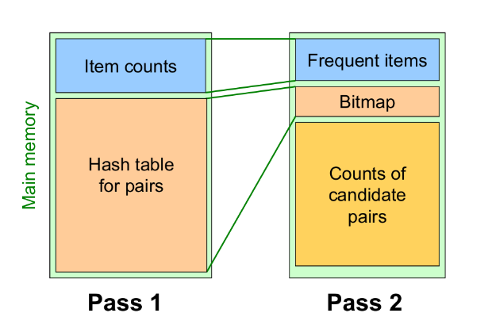

## 2. Advanced Market Basket Analysis

### 2.1 PCY Algorithm 

L'algoritmo PCY (*Park-Chen-Yu*) applica una modifica all'algoritmo classico Apriori. Nel primo step dell'apriori, quando si effettua il conteggio degli item nei basket, la maggior parte della memoria principale resta inutilizzata. Questo algoritmo sfrutta la memoria in idle per risparmiare alcuni calcoli nello step successivo.  

#### 2.1.1 L'algoritmo

Sia $h$ una funzione hash e supponiamo che la memoria in idle sia sufficiente a far entrare $k$ bucket. La funzione hash potrebbe, ad esempio, essere definita come segue
$$
h(x,y) = [(\text{order of }x) \cdot 10 + (\text{order of }y)] \mod{k}
$$
La funzione prende in input coppie di item $(x,y)$ e da in output uno tra i $k$ bucket. Quando si scansionano i carrelli per il conteggio degli item, per ogni coppia $(x,y)$ contenuta nel carrello si calcola l'hash della coppia $h(x,y) = i$, si inserisce la coppia nel bucket $i$-esimo e si incrementa il conteggio delle coppie per quest'ultimo.  

$$
\begin{bmatrix}
\text{bucket address} 	& 0 & 1 & 2 & 3 \\
\text{bucket count} 	& 2 & 3 & 0 & 1 \\
\text{bucket contents} 	& (i_1, i_3) & (i_2, i_5) &  & (i_1, i_3)\\
						& (i_1, i_3) & (i_2, i_5) &  & \\
						&  & (i_7, i_9) &  & \\
\end{bmatrix}
$$
Notiamo che, se il soglia del supporto $minsup = 2$, allora sicuramente le coppie di item che finiranno in bucket con un conteggio minore di 2 non sarà frequente. Tuttavia, la tabella hash è pesante da mantenere in memoria, quindi scremiamo la struttura creando un array di bit di lunghezza $k$ (uno per ogni bucket), un cui asseriamo solo i bit il cui corrispondente bucket ha un conteggio maggiore o uguale a $minsup$. 
$$
[1,1,0,0]
$$
Eliminiamo dalla memoria la tabella hash e manteniamo l'array di bit. Nella generazione delle coppie candidate ad essere frequenti, controlliamo con la funzione di hash se $h(x,y)$ ricade in un bit posto a 0, ed in tal caso scartiamo la coppia, o posto ad 1, quindi la manteniamo come candidata. 

> Supponendo che, al posto della tabella hash, si fosse tenuto in memoria il vettore dei conteggi, ogni conteggio avrebbe occupato 4byte. Con il vettore di bit, per ogni bucket si occupa $\frac{1}{32}$ di quello che si occuperebbe utilizzando il conteggio. 

Questo metodo non ammette falsi positivi: se il conteggio di un bucket non supera la soglia $minsup$, allora una coppia contenuta nel bucket, che sarà presente nei carrelli al più tante volte quanto è il conteggio nel bucket, non supererà anch'essa la soglia. 

> Osservazione: se al conteggio delle coppie utilizziamo una matrice triangolare, lo spreco in termini di spazio è lo stesso (se non maggiore, a causa del vettore di bit) dell'apriori tradizionale. Se con la tabella hash riuscissimo ad eliminare almeno $\frac 2 3$ dei candidati, allora potremmo utilizzare una tabella di triple (item, item, count) e risparmiare comunque spazio, avendo un algoritmo più performante sotto tutti gli aspetti. 

#### 2.1.2 Raffinamento -Multistage 

Dopo aver completato il passo 1 del PCY, è possibile eseguire un hash 

 