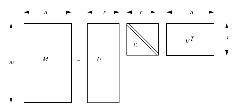

## 3. Dimensionality reduction

### 3.1 Introduzione

Molte fonti di dati possono essere viste come matrici di grandi dimensioni (web, social network [matrici di adiacenza], sistemi di raccomandazione [matrice di utilità]). Una matrice può essere riassunta da matrici di dimensione minore, con cui è più efficiente effettuare operazioni. Queste vengono ricavate con metodi di riduzione della dimensionalità. Si effettua riduzione della dimensionalità poiché alcune feature possono risultare irrilevanti, poiché vi è necessità di visualizzare i dati ad alta dimensionalità o poiché la dimensione intrinseca può essere inferiore al numero di feature. 


#### 3.1.1 Unsupervised feature selection

Nella *feature selection supervisionata* vengono selezionate le feature più interessanti rispetto ad una certa etichetta di classe. La dimensionality reduction può essere considerata una feature selection *non supervisionata*, poiché non si basa su etichette di classe, anche se le feature non vengono selezionate, bensì vengono definite in funzione di quelle originali.


#### 3.1.2 Visualizzazione della riduzione

Supponiamo di avere dei punti distribuiti in uno spazio di dimensione $D$. Può capitare che i punti cadano tutti vicini (o direttamente su) uno spazio a dimensione minore $d$. In questo caso gli assi del sottospazio $d$ sono l’effettiva rappresentazione dei dati. 


#### 3.1.3 Richiami di algebra lineare 

* Il **rango** di una matrice $A$ è un numero intero non negativo associato alla matrice $A$. Ne indica il numero di righe (o colonne) linearmente indipendenti, ovvero non ricavabili attraverso combinazioni lineari di altre righe (o colonne).
* Si dice **base di uno spazio vettoriale** un insieme di vettori grazie ai quali possiamo ricostruire in modo  unico tutti i vettori dello spazio mediante combinazioni lineari. Disponendo di una base di uno spazio vettoriale conosciamo quindi,  automaticamente, l'intero spazio vettoriale.
* Si dicono **coordinate (o componenti) di un vettore rispetto a una base** gli scalari mediante cui il vettore si esprime come combinazione lineare dei vettori della base. Equivalentemente, fissata una base di  uno spazio vettoriale, le coordinate di un vettore rispetto alla base  scelta sono i coefficienti della combinazione lineare con cui si esprime il vettore in termini degli elementi della base.
* Sia $M$ una matrice quadrata. Sia $\lambda$ una costante ed $\bar e$ un vettore colonna non-zero con lo stesso numero di righe di $M$. Diciamo che $\lambda$ è un **autovalore** di $M$ ed $\bar e$ è il suo corrispondente **autovettore** di $M$ se $M \bar e = \lambda \bar e$. La coppia $(\lambda, \bar e)$ prende il nome di **autocoppia**.
* Se $\bar e$ è un autovettore di $M$ con autovalore $\lambda$ e $c$ è una qualsiasi costante, allora anche $c \cdot \bar e$ è un autovettore di $M$ con lo stesso autovalore $\lambda$. Moltiplicare il vettore per una costante cambia il suo modulo ma non la sua direzione. Per evitare ambiguità assumeremo che ogni autovettore sia un vettore unitario (*unit vector*), ovvero di modulo 1. 
* Sia $M$ una matrice quadrata con autovalori $\lambda_1, \dots, \lambda_n$ e corrispondenti autovettori $\bar e_1, \dots, \bar e_n$. Se succede che $|\lambda_1| > \dots > |\lambda_n|$ allora chiameremo $\lambda_1$ **autovalore principale**


#### 3.1.4 Esempio pratico

Supponiamo di avere in input la seguente matrice A
$$
A = \begin{bmatrix}
1 & 1 & 1 & 0 & 0 \\
2 & 2 & 2 & 0 & 0 \\
1 & 1 & 1 & 0 & 0 \\
5 & 5 & 5 & 0 & 0 \\
0 & 0 & 0 & 2 & 2 \\
0 & 0 & 0 & 3 & 3 \\
0 & 0 & 0 & 1 & 1
\end{bmatrix}
$$
La matrice $A$ è bidimensionale, questo poiché è rappresentabile a partire dalla base
$$
[1,1,1,0,0], [0,0,0,1,1] 
$$
Se si volesse ricostruire la quarta riga, sarebbe possibile sfruttare una combinazione lineare dei vettori (generatori) della base: 
$$
5 \cdot [1,1,1,0,0] + 0 \cdot [0,0,0,1,1] = [5,5,5,0,0]
$$
Il rango della matrice è quindi l'effettiva dimensione (intrinseca) della matrice. Facciamo un altro esempio: 
$$
A = \begin{bmatrix}
1 & 2 & 1 \\
-2 & -3 & 1 \\
3 & 5 & 0 \\
\end{bmatrix}
$$
La terza riga è ottenibile dalla differenza tra la prima e la seconda riga, per cui non è linearmente indipendente. Questo vuol dire che il rango è minore di 3. Determinato il rango $\rho(A) = 2$, indichiamo una nuova base per la matrice: 
$$
[1,2,1], [-2,-3,1]
$$
Ed otteniamo delle nuove coordinate per le tre righe:
$$
[1, 0], [0, 1], [1, -1]
$$
I vettori della base sono gli assi di rappresentazione dei dati, per cui possiamo rappresentare i dati come coefficienti di tali vettori e lavorare su dimensioni minori (2 anziché 3). Per ritornare da coordinate $(a, b)$ alla base di partenza è sufficiente calcolare la combinazione lineare $a \cdot [1,2,1] + b \cdot [-2,-3,1]$. 


#### 3.1.5 Idea principale

L'obiettivo della dimensionality reduction è proprio quello di identificare gil assi dei dati. Molto spesso i dati non giacciono esattamente su una dimensione minore, per cui è necessario ammettere un *margine di errore*.  Dato un insieme di punti in uno spazio $d$-dimensionale, l'idea principale è quella di proiettare i dati in uno spazio con meno dimensioni preservando quanta più informazione possibile. Scegliamo la proiezione che minimizza il *quadrato dell'errore* quando ricostruiamo i dati originali. 


### 3.2 Calcolo di autovalori ed autovettori

Nei richiami di algebra lineare abbiamo scritto che, per ogni autocoppia $(\lambda, \bar{e})$ si ha che:
$$
M \bar e = \lambda \bar{e}
$$
Possiamo riscrivere l'equazione nel seguente modo:
$$
(M - \lambda I)e = \bar 0
$$


Dove $I$ è una matrice identità delle stesse dimensioni di $M$. Tale equazione in forma matriciale è rappresentabile come un sistema di equazioni lineari. La matrice $(M - \lambda I)$ corrisponde alla matrice $M$ la cui diagonale è ridotta di una fattore $\lambda$. Sia $\lambda$ incognito, vogliamo trovare gli autovalori e gli autovettori della matrice $M$. 

Per i teoremi sull'algebra lineare, affinché si risolva l'equazione $(M - \lambda I)e = \bar 0$ per un vettore $\bar e \ne \bar 0$, il determinante della matrice $M - \lambda I$ deve essere 0. Sebbene il determinante di una matrice $n \times n$ abbia $n!$ termini, questo può essere calcolato in diversi modi in tempo $O(n^3)$, di seguito vedremo uno tra questi metodi. 


#### 3.2.1 Chiò pivotal condensation 

Il metodo *Chio pivotal condensation* (condensazione pivotale) permette di calcolare il determinante di una matrice $A$ di dimensione $n \times n$ andando a dividere il determinante di una nuova matrice $B$ di dimensione $(n-1) \times (n-1)$ per il primo elemento della matrice $A$ elevato ad $n-2$: 
$$
\det(A) = \frac{\det(B)}{a_{11}^{n-2}}
$$
Ipotesi necessaria è che la diagonale della matrice $A$ sia non nulla, quindi che $a_{ii} \ne 0$. La matrice $B$ va costruita in funzione della matrice $A$. Il generico elemento $b_{ij}$ è ottenuto come segue:
$$
b_{ij} = a_{11} \times a_{i+1,j+1} - a_{1, j+1} \times a_{i+1, 1}
$$
Si applica ricorsivamente il metodo alla matrice $B$ sino a che non si arriva ad una matrice il quale determinante è trattabile con metodi diretti. 


#### 3.2.2 Risolvere l'equazione 

Dato che il determinante della matrice $(M - \lambda I)$ è un polinomio di grado $n$ dove $\lambda$ è l'incognita, allora possiamo ottenere $n$ soluzioni, ovvero ottenere tutti ed $n$ gli autovalori della matrice $M$. Un valore $c$ qualsiasi tra queste $n$ soluzioni risolverà l'equazione $M \bar{e} = c \bar{e}$. 

Per ogni autovalore $\lambda$ trovato, è possibile ricavare il corrispondente autovettore $\bar{e}$ risolvendo il sistema lineare di $n$ equazioni in $n$ incognite, ovvero le componenti dell'autovettore $\bar e$: 
$$
(M - \lambda I)\bar{e} = \bar{0}
$$
Per semplicità imponiamo che ogni autovettore sia unitario, trovando così una sola soluzione. Facciamo un esempio banale: 
$$
M = \begin{bmatrix}
2 & 1  \\
3 & 2 \\
\end{bmatrix}
$$
Quindi impostiamo l'equazione: 
$$
\left( 
\begin{bmatrix}
2 & 1  \\
3 & 2 \\
\end{bmatrix} 
- 
\begin{bmatrix}
\lambda & 0  \\
0 & \lambda \\
\end{bmatrix} 
\right)
\cdot
\begin{bmatrix}
e_1 \\
e_2 \\
\end{bmatrix} 
= 
\begin{bmatrix}
0 \\
0 \\
\end{bmatrix}
$$
Risolvendo la sottrazione all'interno delle parentesi otteniamo: 
$$
(M-\lambda I) = \begin{bmatrix}
2 - \lambda & 1  \\
3 & 2 - \lambda \\
\end{bmatrix}
$$
Il determinante di questa matrice deve essere 0 poiché il sistema lineare abbia soluzioni: 
$$
\det \left(
\begin{bmatrix}
2 - \lambda & 1  \\
3 & 2 - \lambda \\
\end{bmatrix}
\right) = 
\left[ (2 - \lambda) \times (2 - \lambda) \right] - (3 \times 1) = \lambda^2 -4\lambda +1 = 0
$$
Risolvendo il polinomio di grado $n=2$ troviamo i due autovalori: 
$$
\lambda_1 = 2 + \sqrt{3} \text{ ; } \lambda_2 = 2 - \sqrt{3}
$$
Prendiamo la soluzione $\lambda_1$ e sostituiamola all'equazione precedente: 
$$
\left( 
\begin{bmatrix}
2 & 1  \\
3 & 2 \\
\end{bmatrix} 
- 
\begin{bmatrix}
\lambda_1 & 0  \\
0 & \lambda_1 \\
\end{bmatrix} 
\right)
\cdot
\begin{bmatrix}
e_1 \\
e_2 \\
\end{bmatrix} 
= 
\begin{bmatrix}
0 \\
0 \\
\end{bmatrix}
$$
Ovvero: 
$$
\begin{cases}
(2 - \lambda_1)e_1 + e_2 = 0 \\
3e_1 + (2-\lambda_1)e_2 = 0 \\ 
\sqrt{e_1^2 + e_2^2} = 1 \text{ (vincolo)}
\end{cases}
$$
Risolviamo il sistema lineare ed otteniamo le componenti dell'autovettore $\bar{e}^{(1)}$ associato all'autovalore $\lambda_1$. Ripetiamo il processo con l'autovalore $\lambda_2$. 

 

#### 3.2.3 Power iteration

Nella pratica, per matrici molto grandi, la soluzione precedente non è ammissibile. Studiamo un metodo alternativo computazionalmente meno oneroso, chiamato *power iteration*. 
Sia $M$ una matrice di dimensioni $n \times n$ per la quale desideriamo calcolare le autocoppie. 

Partiamo da un vettore generato casualmente $\bar{x}_1$ di dimensione $n$. Calcoliamo un nuovo vettore $\bar{x}_2$ come segue:
$$
\bar{x}_2 = \frac{M \cdot \bar{x}_1}{||M \cdot \bar{x}_1||}
$$
dove con $||M||$ intendiamo la *norma di Frobenius*: 
$$
||M|| = \sqrt{\sum_{i,j}m_{ij}^2} 
$$
Osserviamo che, così facendo, il vettore $\bar{x}_2$ sarà normalizzato ad 1. Procediamo iterativamente calcolando il generico vettore $\bar{x}_i$ (per $i > 1$) come segue: 
$$
\bar{x}_i = \frac{M \cdot \bar{x}_{i-1}}{||M \cdot \bar{x}_{i-1}||}
$$
Fissato arbitrariamente un valore costante piccolo $\epsilon$, l'iterazione si fermerà quando 
$$
|| x_i - x_{i+1}|| \le \epsilon
$$
A questo punto, $x_i$ è approssimativamente l'autovettore ***principale*** di $M$. Calcoliamo l'autovalore corrispondente attraverso la formula inversa: 
$$
\lambda_1 = {\bar{x}_i}^T \cdot M \cdot \bar{x}_i
$$
Utilizzando questo metodo ricaveremo la prima autocoppia principale $(\lambda_1, \bar{x}_1)$ (oss. $\lambda_1$ è l'autovalore più grande). Per calcolare le rimanenti autocoppie è necessario enunciare il seguente teorema.


#### 3.2.4 Generalizzazione della Power iteration

Sia $A$ una matrice simmetrica di dimensione $n \times n$ con $(\lambda_1, \dots, \lambda_n)$ autovalori e $(\bar{v}_1, \dots, \bar{v}_n)$ autovettori. Supponiamo di aver calcolato l'autocoppia principale $(\lambda_1, \bar{v}_1)$ attraverso la power iteration. Per trovare la seconda autocoppia, creiamo una nuova matrice: 
$$
B = A - \lambda_1 \bar{v}_1 \bar{v}_1^{T}
$$
Applicare la power iteration alla matrice $B$ restituirà l'autocoppia principale $(\lambda^*, \bar{v}^*)$ della matrice $B$, ovvero l'autocoppia con autovalore più grande. Tale autocoppia corrisponde alla seconda autocoppia della matrice $A$ di partenza. Intuitivamente, quello che abbiamo fatto è stato rimuovere l'influenza dell'autovettore principale $\bar v_1$ impostando il corrispondente autovalore principale $\lambda_1$ a zero. Ciò viene giustificato dalle seguenti osservazioni:

- $\bar v_1$ è ancora un autovettore di $B$ ed il suo autovalore corrispondente è $0$. 
- se $(\lambda, \bar v_{\lambda})$ è una autocoppia (non principale) di una matrice simmetrica $A$ allora sarà una autocoppia di $B$.

È possibile trovare tutte le autocoppie ripetendo iterativamente il metodo:
$$
B_{t+1} = B_{t} - \lambda_t \bar{v}_t \bar{v}_t^{T}
$$

> Osservazione: Se gli autovettori non sono unitari, allora non sarà possibile calcolare la matrice B con l'espressione indicata, bensì si dovrà trovare un vettore $\bar x$ tale che $\bar{v} \cdot \bar{x} = 1$ e quindi calcolare la matrice B come segue: 
> $$
> B = A - \lambda_1 \bar{v}_1 \bar{x}^T
> $$

> Il professore sostiene che l'autovettore ottenuto dalla power iteration su $B$, che chiameremo $\bar u_i$ non corrisponda all'autovettore su $A$, che chiameremo $\bar v_i$, e che per calcolare l'autovettore originale bisogna applicare la seguente formula: 
> $$
> \bar v_i = (\lambda_1 - \lambda_i) \cdot \bar u_i + \lambda_1 \cdot (\bar v_1^T \cdot \bar u_i) \cdot \bar v_1 \text{ per } i = 2, \dots, n
> $$


#### 3.2.5 Implementazione  

```python
import numpy as np
import numpy.linalg as la 

def powi (m, max_iter = 10 ** 3):
    """ power iteration method """
    _, n = m.shape
    x = np.ones(n)
    for _ in range(max_iter):
        mx = np.dot(m, x)
        fn = la.norm(mx, 'fro')
        x = mx / fn
        x = x.A[0]
    ev = np.dot(np.dot(x.T, m), x).item(0)
    return ev, x
  

def eigenpairs(m):
    """ power iteration generalization for all eigenpairs """
    _, n = m.shape 
    b = m 
    evecs = [] 
    evals = []
    for i in range(n):
        lambdai, ei = powi(b)    
        evecs.append(ei)
        evals.append(lambdai)
        eim = np.matrix(ei)
        b = b - lambdai * eim.T.dot(eim)
    return evals, evecs 

def main():
    m = np.matrix([
            [1,3,5],
            [2,4,1],
            [6,1,9],
        ])

    eigen_values, eigen_vectors = eigenpairs(m)

    for key, val in enumerate(eigen_values):
        print(f'{key}) \t {val}')
```


### 3.2 PCA - Principal-Component Analysis

La Principal-Component Analysis (PCA) è una tecnica che prende un dataset relativo ad un insieme di tuple in uno spazio ad alta dimensione e trova le direzioni (assi) lungo il quale le tuple si allineano meglio. Trattiamo l'insieme di tuple come una matrice $M$ e troviamo gli autovettori di $MM^T$ o $M^TM$. La matrice di questi autovettori può essere pensata come una [rotazione rigida](https://it.wikipedia.org/wiki/Rotazione_(matematica)) dello spazio ad alta dimensione. 


#### 3.2.1 Esempio illustrativo


Rappresentiamo i dati nell'asse su una matrice $4 \times 2$: 
$$
M = \begin{bmatrix}
1 & 2 \\
2 & 1 \\
3 & 4 \\
4 & 3 \\
\end{bmatrix}
$$
Calcoliamo il prodotto matriciale $M^TM$ 
$$
M^TM = 
\begin{bmatrix}
1 & 2 & 3 & 4 \\
2 & 1 & 4 & 3 \\
\end{bmatrix}
\begin{bmatrix}
1 & 2 \\
2 & 1 \\
3 & 4 \\
4 & 3 \\
\end{bmatrix}
= 
\begin{bmatrix}
30 & 28 \\
28 & 30 \\
\end{bmatrix}
$$
Troviamo gli autovalori come fatto nel paragrafo 3.2.2 
$$
(30 - \lambda)(30 - \lambda) - 28 \times 28 = 0
$$
Le cui soluzioni sono $\lambda_1 = 58$ e $\lambda_2 = 2$. Troviamo gli autovettori risolvendo l'equazione lineare per ogni autovalore:
$$
\text{ per } \lambda_1 = 58 \text{ abbiamo } e_1 = \begin{bmatrix} 
\frac{1}{\sqrt{2}} \\
\frac{1}{\sqrt{2}} \\
\end{bmatrix}
$$

$$
\text{ per } \lambda_2 = 2 \text{ abbiamo } e_2 = \begin{bmatrix} 
- \frac{1}{\sqrt{2}} \\
\frac{1}{\sqrt{2}} \\
\end{bmatrix}
$$

Costruiamo la matrice $E$ affiancando gli autovettori trovati e posizionando per primo l'autovettore principale: 
$$
E = \begin{bmatrix}
\frac{1}{\sqrt{2}} & - \frac{1}{\sqrt{2}} \\
\frac{1}{\sqrt{2}} & \frac{1}{\sqrt{2}} \\
\end{bmatrix}
$$
Ogni matrice con vettori ortonormali (vettori unitari ed ortogonali l'un l'altro) rappresenta una rotazione e/o riflessione degli assia di uno spazio Euclideo. Se moltiplichiamo la matrice $M$ per la matrice $E$ (rotazione) otteniamo:
$$
ME = \begin{bmatrix}
1 & 2 \\
2 & 1 \\
3 & 4 \\
4 & 3 \\
\end{bmatrix}
\begin{bmatrix}
\frac{1}{\sqrt{2}} & - \frac{1}{\sqrt{2}} \\
\frac{1}{\sqrt{2}} & \frac{1}{\sqrt{2}} \\
\end{bmatrix}
=
\begin{bmatrix}
\frac{3}{\sqrt{2}} & \frac{1}{\sqrt{2}}  \\
\frac{3}{\sqrt{2}} & \frac{-1}{\sqrt{2}} \\
\frac{7}{\sqrt{2}} & \frac{1}{\sqrt{2}}  \\
\frac{7}{\sqrt{2}} & \frac{-1}{\sqrt{2}} \\
\end{bmatrix}
$$
Nel caso in esempio, la matrice rappresenta una rotazione di $45°$ in senso antiorario. 


I punti mantengono le proporzioni dopo la rotazione, vediamolo graficamente: 


#### 3.2.2 Ridurre la dimensionalità con PCA

$ME$ corrisponde ai punti di $M$ trasformati in uno spazio di nuove coordinate. In questo spazio, il **primo asse** (quello che corrisponde al più grande autovalore) è il più significativo; formalmente, la varianza di un punto lungo questo asse è la più grande. Il **secondo asse** corrisponde al secondo autovalore, è il successivo secondo autovalore più significativo nello stesso senso. Questo pattern si presenta per ogni autocoppia. Per trasformare $M$ in uno spazio con meno dimensioni, basta preservare le dimensioni che usano gli autovettori associati ai più alti autovalori e cancellare gli altri. Sia $E_k$ la matrice formata dalle prime $k$ colonne di $E$. Allora $ME_k$ è una rappresentazione di $M$ a $k$ dimensioni. 

Nel nostro esempio, rimuoviamo il secondo autovettore $e_2$ dalla matrice $E$ e ricalcoliamo il prodotto $EM$: 
$$
ME_1 = \begin{bmatrix}
1 & 2 \\
2 & 1 \\
3 & 4 \\
4 & 3 \\
\end{bmatrix}
\begin{bmatrix}
\frac{1}{\sqrt{2}} \\
\frac{1}{\sqrt{2}} \\
\end{bmatrix}
=
\begin{bmatrix}
\frac{3}{\sqrt{2}} \\
\frac{3}{\sqrt{2}} \\
\frac{7}{\sqrt{2}} \\
\frac{7}{\sqrt{2}} \\
\end{bmatrix}
$$
Tale procedura ci garantisce un errore di approssimazione minimo. 


#### 3.2.3 Pseudocodice

```
	
	PCA (M, k): 
		# Sia M una matrice di dati N x d, con ogni riga un vettore dei dati. 
		# Otteniamo la matrice di covarianza di M (sottraendo la media)
		Sigma <- sottraiamo la media m da ogni vettore riga (opzionale)
		autocoppie <- troviamo le autocoppie di Sigma 
		PC <- prendiamo i k autovettori con gli autovalori più grandi (principal components)
         # PC sarà una matrice e gli autovettori saranno posizionati in colonna
         return M * PC 
		
```


### 3.3 SVD - Singular Value Decomposition 

La Singular Value Decomposition (SVD) è una tecnica che permette di ottenere una rappresentazione a basse dimensioni di una matrice ad alte dimensioni e funziona per qualsiasi matrice. Maggiore è la riduzione, minore sarà l'accuratezza della approssimazione. 


#### 3.3.1 Definizione di SVD

Sia $M$ una matrice $m \times n$, e sia $r$ il suo rango. Allora sarà possibile trovare le matrici $U$, $\Sigma$, e $V$ con le seguenti proprietà: 

* $U$ è una *column-orthonormal matrix*, le cui colonne sono vettori unitari (vettori singolari di sinistra). 
* $V$ è una *column-orthonormal matrix*, le cui colonne sono vettori unitari (vettori singolari di destra). 
* $\Sigma$ è una matrice diagonale, i cui elementi (nella diagonale) sono chiamati valori singolari di $M$. 

Possiamo scrivere: 
$$
M = U \cdot \Sigma \cdot V^T
$$


> Per "column-orthonormal matrix" intendiamo una matrice le cui colonne sono [vettori ortonormali](https://en.wikipedia.org/wiki/Orthonormality), per cui il prodotto scalare tra due colonne distinte arbitrarie è 0. Si ha quindi che $U^TU = V^TV = I$. 

>  Nella decomposizione si farà utilizzo della trasposta della matrice $V$, quindi $V^T$. Essendo $V$ una column-orthonormal matrix e $V^T$ la sua trasposta, allora $V^T$ sarà una row-orthonormal matrix. 




#### 3.3.2 Interpretazione della SVD 

Sia $M$ una matrice di dimensione $7 \times 5$ contenente nelle righe gli utenti e nelle colonne i film valutati dagli utenti. Supponiamo che i primi 3 film nelle colonne siano fantascientifici, mentre gli ultimi due siano romantici: 
$$
M = \begin{bmatrix}
1 & 1 & 1 & 0 & 0 \\
3 & 3 & 3 & 0 & 0 \\
4 & 4 & 4 & 0 & 0 \\
5 & 5 & 5 & 0 & 0 \\
0 & 0 & 0 & 4 & 4 \\
0 & 0 & 0 & 5 & 5 \\
0 & 0 & 0 & 2 & 2 \\
\end{bmatrix}
$$
Le prime 4 righe sono linearmente indipendenti tra loro, così come le ultime 3 righe. Di fatto, il rango della matrice risulta essere $r = 2$. Supponiamo di aver già calcolato le tre matrici $U$, $V$ e $\Sigma$, scriviamo l'equazione della decomposizione: 
$$
(M)
\begin{bmatrix}
1 & 1 & 1 & 0 & 0 \\
3 & 3 & 3 & 0 & 0 \\
4 & 4 & 4 & 0 & 0 \\
5 & 5 & 5 & 0 & 0 \\
0 & 0 & 0 & 4 & 4 \\
0 & 0 & 0 & 5 & 5 \\
0 & 0 & 0 & 2 & 2 \\
\end{bmatrix}
= 
(U)
\begin{bmatrix}
.14 & 0 \\
.42 & 0 \\
.56 & 0 \\
.70 & 0 \\
0 & .60 \\
0 & .75 \\
0 & .30 \\
\end{bmatrix}
(\Sigma)
\begin{bmatrix}
12.4 & 0 \\
0 & 9.5  \\
\end{bmatrix}
(V^T)
\begin{bmatrix}
.58 & .58 & .58 & 0 & 0 \\
0 & 0 & 0 & .71 & .71 \\
\end{bmatrix}
$$
La chiave di lettura della decomposizione sta nell'interpretare le $r$ colonne delle matrici $U$, $V$ e $\Sigma$ come **concetti** nascosti nella matrice di partenza $M$. Nell'esempio i concetti sono molto chiari, le due colonne indicano i due generi principali: fantascientifico e romantico. La matrice $U$ connette gli utenti (righe di $M$) ai generi (concetti), mentre la matrice $V$ conette i film (colonne di $M$) ai concetti. Infine, la matrice $\Sigma$ indica la forza di ogni concetto. 

L'esempio è particolarmente banale, nella pratica spesso la dimensione desiderata è inferiore al rango della matrice, per cui è necessario applicare alcune modifiche ed ottenere una decomposizione non esatta, ma che approssima al meglio la matrice $M$. È necessario eliminare dalla decomposizione esatta quelle colonne di $U$ e $V$ che corrispondono ai valori singolari più piccoli (concetti meno affermati) così da ottenere una buona approssimazione. 

Modifichiamo leggermente la matrice d'esempio e vediamo cosa succede: 
$$
M = \begin{bmatrix}
1 & 1 & 1 & 0 & 0 \\
3 & 3 & 3 & 0 & 0 \\
4 & 4 & 4 & 0 & 0 \\
5 & 5 & 5 & 0 & 0 \\
0 & 2 & 0 & 4 & 4 \\
0 & 0 & 0 & 5 & 5 \\
0 & 1 & 0 & 2 & 2 \\
\end{bmatrix}
$$
Il rango della matrice $M$ è adesso $r = 3$ a causa delle modifiche: le ultime tre colonne non sono più tutte linearmente indipendenti. Tuttavia i concetti rimangono gli stessi. Vediamo cosa succede alla decomposizione: 
$$
(U)
\begin{bmatrix}
.13 & .02 & -.01 \\
.41 & .07 & -.03 \\
.55 & .09 & -.04 \\
.68 & .11 & -.05 \\
.15 & -.59 & .65 \\
.07 & -.73 & -.67 \\
.07 & -.29 & .32 \\
\end{bmatrix}
(\Sigma)
\begin{bmatrix}
12.4 & 0 & 0 \\
0 & 9.5  & 0 \\
0 & 0  & 1.3 \\
\end{bmatrix}
(V^T)
\begin{bmatrix}
.58 & .59 & .56 & .09 & .09  \\
.12 & -.02 & .12 & .69 & .69 \\
.40 & -.80 & .40 & .09 & .09 \\
\end{bmatrix}
$$
Il terzo valore singolare risulta molto piccolo rispetto ai primi due, poiché di fatto non è realmente incisivo (nel caso analizzato non indica nessun genere), vorremmo quindi eliminarlo. 


#### 3.3.3 Ridurre la dimensionalità con SVD

Supponiamo di voler rappresentare una matrice molto grande attraverso le sue componenti $U$, $V$ e $\Sigma$ ottenute attraverso la SVD. Tuttavia, anche queste ultime risultano essere molto grandi da conservare. Il miglior modo per ridurre la dimensionalità delle tre matrici è azzerare il valore singolare di $\Sigma$ più piccolo e, di conseguenze, eliminare le corrispondenti colonne nelle matrici $U$ e $V$. 

Riprendiamo l'esempio precedente: supponiamo di voler passare da 3 dimensioni a 2. Il valore singolare più piccolo risulta essere 1.3, per cui lo azzeriamo e rimuovamo la terza colonna di $U$ e la terza riga di $V^T$: 
$$
\hat{M} = (U)
\begin{bmatrix}
.13 & .02  \\
.41 & .07  \\
.55 & .09  \\
.68 & .11  \\
.15 & -.59 \\
.07 & -.73 \\
.07 & -.29 \\
\end{bmatrix}
(\Sigma)
\begin{bmatrix}
12.4 & 0 & 0 \\
0 & 9.5  & 0 \\
\end{bmatrix}
(V^T)
\begin{bmatrix}
.58 & .59 & .56 & .09 & .09  \\
.12 & -.02 & .12 & .69 & .69 \\
\end{bmatrix}
$$
La matrice $\hat M$ risultante dal prodotto $U\Sigma V^T$ non coincide perfettamente con $M$, ma ne è una buona approssimazione. Se calcoliamo l'RMSE (root mean square error) attraverso la norma di Frobenius sulla matrice $M - \hat M$ otteniamo: 
$$
\text{RMSE} = ||M - \hat M||_F = \sqrt{ \sum_{ij} (M_{ij} - \hat{M}_{ij})^2}
$$
È possibile dimostrare attraverso un teorema che $\hat{M}$ ottenuta rimuovendo i valori singolari più piccoli dalla decomposizione, e calcolando l'errore di approssimazione attraverso la metrica RMSE è la "***best low rank approximation***" di $M$, ovvero l'approssimazione migliore ottenibile dalle 3 matrici $U$, $V$ e $\Sigma$. 

p 423 del libro. 