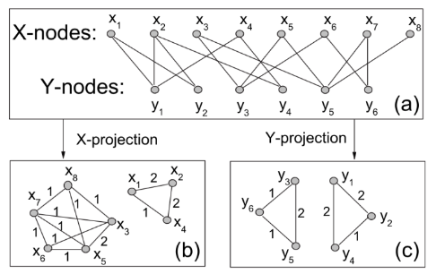

## 4. Sistemi avanzati di raccomandazione

È possibile trovare una introduzione ai sistemi di raccomandazione nel testo [*Dive Into Data Mining*](https://github.com/LemuelPuglisi/DiveIntoDataMining). 

### 4.1 LSI - Latent Semantic Indexing (LSI)

Il LSI è una tecnica sviluppata nei primi anni '90 che risolve il problema della sparsità e scalabilità per grandi dataset nel contesto semantico. Consiste principalmente nel ridurre la dimensionalità e catturare le relazioni latenti su matrici *termini-documenti*. Questa tecnica di indicizzazione utilizza la decomposizione SVD per identificare pattern nella relazione tra termini e concetti contenuti nel testo: si basa sul principio che parole utilizzate nello stesso contesto tendono ad avere significato simile. 

#### 4.1.1 LSI per sistemi di raccomandazione

È possibile applicare la tecnica LSI nel contesto dei sistemi di raccomandazione:

* La matrice *termini-documenti* sarà sostituita con la *matrice di utilità* $M$
* Le categorie degli item prenderanno il posto dei concetti
* Il mapping $\text{termini} \to \text{concetti}$, $\text{documenti} \to \text{concetti}$ diviene $\text{item} \to \text{categorie}$, $\text{utenti} \to \text{categorie}$

Quindi si calcola la SVD della matrice $U$: 
$$
M = U\Lambda V^T
$$
Dalle proprietà della SVD sappiamo che le matrici $U$ e $V$ sono matrici dense.Sia $p$ il vettore contenente tutte le valutazioni effettuate dall'utente $x$ sugli $n$ item, supponendo che se l'utente $x$ non ha valutato l'item $j$, allora $p_j = 0$.  Calcoliamo
$$
\bar{p} = p \times V \\
\bar{p} = \begin{bmatrix}
\bar{p}_1 & \dots & \bar{p}_r 
\end{bmatrix} = 
\begin{bmatrix}
p_1 & \dots & p_n 
\end{bmatrix} \times 
\begin{bmatrix}
v_{11} & \dots & v_{1r} \\
v_{21} & \dots & v_{2r} \\
\dots \\
v_{n1} & \dots & v_{nr} \\
\end{bmatrix} 
$$
dove $V$ è la matrice di dimensione $n \times r$ della decomposizione che rappresenta la corrispondenza film-categorie. Così facendo, mappiamo le valutazioni correnti dell'utente dallo spazio originale a quello delle categorie. Calcoliamo la predizione della valutazione dell'utente $x$ su tutti i film come segue
$$
\hat{p} = \bar{p} \times V^T
$$

### 4.2 Metodi Graph-based

I metodi graph-based sfruttano una idea simile a quella del collaborative filtering, ma utilizzano un grafo bipartito per immagazzinare le informazioni. Le raccomandazioni sono ottenute a partire dalla struttura della rete bipartita. 

Sia $G(U,O,E,W)$ un grafo bipartito, in cui $U$ di cardinalità $n$ ed $O$ di cardinalità $m$ sono due classi di identitià indicanti rispettivamente gli utenti e gli oggetti. Sia $E$ l'insieme degli archi
$$
E = \{e_{ij} : u_i \text{ valuta } o_j \}
$$
E $W$ una funzione peso $W:E\to R$ che rappresenta il grado di preferenza espresso dall'utente per un particolare oggetto.  La utility matrix corrisponde alla matrice di adiacenza del grafo bipartito. 

#### 4.2.1 NBI - Network-based inference 

La network-based inference è una tecnica sviluppata nel 2007 in cui si effettuano delle proiezioni sul grafo bipartito per ottenere informazioni. Dal grafo definito in precedenza è possibile estrarre due proiezioni: la proiezione rispetto agli utenti e quella rispetto agli oggetti. In una proiezione vi sono nodi appartenenti allo stesso insieme e due nodi sono connessi se e solo se sono connessi ad almeno un nodo in comune dell'altro insieme nel grafo $G$ di partenza. 

#### 4.2.2 Idea dell'NBI 

Sia $G$ il grafo bipartito definito in precedenza, definiamo una matrice di adiacenza $A$ dove
$$
a_{ij} = \begin{cases}
1 \text{ se i nodi sono connessi } \\
0 \text{ altrimenti }
\end{cases}
$$
Si esegue un processo di trasferimento delle risorse (*resource transfer*) tra i due insiemi della rete: all'inizio vengono trasferite delle risorse dall'insieme $O$ all'insieme $U$ e, successivamente, le risorse tornano da $U$ ad $O$. La risorsa contenuta in un nodo viene trasferita equamente ai nodi adiacenti nell'altro insieme. Il processo a due fasi si ripete sino a convergenza. Questo metodo ci permette di definire una tecnica per il calcolo della matrice dei pesi $W$ di dimensione $n \times n$ di una **proiezione** di $G$ come segue: 
$$
w_{ij} = \frac{1}{\Gamma(i,j)} \sum_{l=1}^{n} \frac{a_{il}a_{jl}}{k(u_i)}
$$
Dove con $k(u_i)$ indichiamo il grado di $u_i$ (quanti oggetti ha valutato l'utente $u_i$), e la funzione $\Gamma$ è arbitraria e definisce il metodo graph-based utilizzato: 
$$
\Gamma(i,j) = \begin{cases}
k(o_j) \text{ per il metodo NBI } \\ 
k(o_i) \text{ per il metodo HeatS }
\end{cases}
$$
Per ottenere le predizioni delle valutazioni, ovvero la matrice di raccomandazione $R$, è sufficiente computare il prodotto riga-colonna tra la matrice $W$ dei pesi della proiezione del grafo bipartito, che ha una dimensione $n \times n$, per la matrice $A$ di adiacenza del grafo bipartito $G$, che ha una dimensione $n \times m$ 
$$
R = W \cdot A
$$
Il peso $w_{ij}$ della proiezione corrisponde a quante risorse vengono trasferite dall'oggetto $j$ all'oggetto $i$, o quanto piacerà l'oggetto $j$ ad un utente a cui piace l'oggetto $i$. 

> Il NBI funziona su tutti i tipi di oggetti e risolve il problema della sparsità della utility matrix. Tuttavia persistono i problemi con i nuovi utenti o i nuovi item ed il metodo richiede importanti risorse computazionali. 

