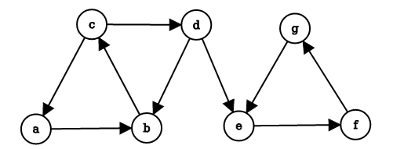

## 6. Link analysis

Il web è un grafo orientato i cui nodi sono rappresentati dalle pagine web, mentre gli archi corrispondono ai link tra le pagine. Data una query di ricerca, il problema del web search consiste nel restituire dei siti web coerenti con la query, ma soprattutto autorevoli. Il primo approccio alla navigazione web fu' la *web directory*, ovvero un elenco di siti web curati manualmente e suddivisi in maniera gerarchica. Una web directory non è un motore di ricerca e risulta essere molto limitante. Il secondo tentativo fu' proprio il web search, che consiste in due problemi: il primo problema è il più semplice, consiste nel trovare un insieme di pagine che contengono parole in comune con la query, il secondo problema è più complesso e consiste nel ritornare solo pagine web autorevoli ed evitare lo spam. 

### 6.1 PageRank

Il PageRank è un algoritmo di link analysis creato da Page, uno dei due fondatori di Google. Supponiamo di dare un valore di importanza iniziale a tutti i nodi, interpretiamo i link come dei "voti" e, se un nodo ha 10 link uscenti, allora dividerà la propria importanza equamente tra tutti e 10 i nodi. I link da pagine web importanti contano di più e tale concetto è implementabile attraverso la ricorsione. 

#### 6.1.1 Formulazione ricorsiva di base

Ogni voto di un link è proporzionale all'importanza della sua pagina sorgente. Se la pagina $j$ con importanza $r_j$ ha $n$ link uscenti, ogni link prende $\frac{r_j}{n}$ voti. L'importanza di $j$ è la somma dei voti dei suoi link entranti. Possiamo osservare che un voto da una pagina importante vale di più, e che una pagina è importante se viene puntata da altre pagine importanti. Definiamo il rank $r_j$ per la pagina $j$ attraverso una equazione di flusso 
$$
r_j = \sum_{i\to j} \frac{r_i}{d_i^{out}}
$$
Quindi il rank $r_j$ è dato dalla somma, per tutti i nodi $i$ che puntano a $j$, del voto del nodo $i$, che è calcolato dividendo la sua importanza per il suo grado uscente. Vediamo un grafo d'esempio

In questo caso avremo che 
$$
\begin{cases}
r_m = \frac{r_a}{2} \\
r_a = r_m + r_y \\ 
r_y = \frac{r_a}{2}
\end{cases}
$$
Questo è un sistema di 3 equazioni in 3 incognite con infinite soluzioni (equivalenti a meno di un fattore di scala). Un vincolo addizionale rende la soluzione unica: 
$$
r_y + r_a + r_m = 1
$$
Da cui otteniamo che $r_a = \frac 1 2$, $r_y = \frac 1 4$ ed $r_m = \frac 1 4$. Con un risolutore di equazioni lineari è possibile trovare le soluzioni per piccoli grafi. Tuttavia, il grafo del web è massivo e necessita di una nuova formulazione. 

#### 6.1.2 Formulazione matriciale

Supponiamo di avere una matrice di adiacenza $M$ per il grafo del web e consideriamo la formulazione stocastica di tale matrice, ovvero:
$$
M_{ij} = \begin{cases}
\frac{1}{d_j^{out}} \text{ if } j \to i \\
0 \text{ otherwise }
\end{cases}
$$
La riga $i$-esima della matrice indica gli archi entranti ad $i$. L'elemento $(i,j)$ vale $\frac 1 n$ se il nodo $j$, supponendo abbia $n$ archi uscenti, ha un arco uscente che punta ad $i$. Strutturando così la matrice avremo che la somma delle colonne sarà pari ad 1. 

#### 6.1.3 Vettore dei rank 

Introduciamo un vettore $r$, chiamato vettore dei rank, tale che per ogni componente $i$, $r_i$ indichi il rank del nodo $i$-esimo. Imponiamo come vincolo che la somma delle componenti sia 1, quindi $\sum_i r_i = 1$. Possiamo riscrivere l'equazione di flusso (1) nel seguente modo: 
$$
r = M \cdot r
$$
Nel prodotto riga colonna, la componente $j$ di $r$ verrà calcolata attraverso la somma dei rank dei nodi che puntano a $j$ (informazione contenuta nel vettore $r$), diviso per il loro grado uscente (informazione contenuta nella matrice $M$). Osserviamo che $r$ è un *autovettore* della matrice stocastica $M$, con corrispondente autovalore $\lambda=1$. Possiamo dire inoltre che 1 è l'autovalore più grande, essendo $M$ una matrice stocastica sulle colonne (con entry non-negative). A questo punto è possibile ottenere $r$ attraverso il metodo Power iteration: 

* Supponiamo di avere $N$ pagine web, inizializziamo $r^{(0)} = [\frac 1 N, \dots, \frac 1 N]^T$; 
* Iteriamo lo step di aggiornamento $r^{(t+1)} = M \cdot r^{(t)}$
* Fermiamo l'iterazione quando $|r^{(t+1)} - r^{(t)}|_1<\epsilon$

Calcoliamo il rank vector per l'esempio precedente (2). La matrice $M$ stocastica sarà
$$
\begin{array}{c c} &
	\begin{array}{c c c} a & m & y \\
	\end{array} \\
	\begin{array}{c c c}
	a \\
	m \\
	y \\
	\end{array}
& \left[
	\begin{array}{c c c}
	0.0 & 1.0 & 1.0 \\
	0.5 & 0.0 & 0.0 \\
	0.5 & 1.0 & 0.0 \\
	\end{array}
\right]
\end{array}
$$
Inizializziamo $r$ casualmente 
$$
r^{(0)} = \begin{bmatrix}
\frac 1 3 \\
\frac 1 3 \\
\frac 1 3 \\
\end{bmatrix}
$$
Quindi computiamo
$$
r^{(1)} = 
\begin{bmatrix}
0.0 & 1.0 & 1.0 \\
0.5 & 0.0 & 0.0 \\
0.5 & 1.0 & 0.0 \\
\end{bmatrix} \cdot
\begin{bmatrix}
\frac 1 3 \\
\frac 1 3 \\
\frac 1 3 \\
\end{bmatrix} =
\begin{bmatrix}
\frac 2 3 \\
\frac 1 6 \\
\frac 1 6 \\
\end{bmatrix}
$$
E continuiamo fino a convergenza. 

#### 6.1.4 Random walk surfer 

Immaginiamo un random web surfer, ovvero qualcuno che navighi tra le pagine del web attraverso i link. Se al tempo $t$ il surfer è sulla pagina $i$, allora al tempo $t+1$ il surfer seguirà uno tra i link uscenti di $i$ in maniera casuale ed uniforme. Il processo è ripetuto all'infinito. 

Sia $p(t)$ il vettore la cui $i$-esima componente indica la probabilità che il surfer sia alla pagina $i$ a tempo $t$. Allora $p(t)$ è la distribuzione di probabilità sulle pagine del web. Possiamo descrivere il cammino del random surfer come un processo markoviano, per cui avremo 
$$
p(t+1) = M \cdot p(t)
$$
Supponiamo che si raggiunga uno stato per cui
$$
p(t+1) = M \cdot p(t) = p(t)
$$
Allora $p(t)$ sarà la *distribuzione stazionaria* del random walk. Il nostro vettore $r$ soddisfa $r = M \cdot r$, quindi $r$ è la distribuzione stazionaria della random walk eseguita dal random web surfer. Dallo studio delle catene di Markov si evince che per grafi che soddisfano certe condizioni, la distribuzione stazionaria è ***unica*** e sarà raggiunta a prescindere da quali saranno le probabilità iniziali a tempo $t=0$. 

#### 6.1.5 Oscillazioni, dead-end e spider-trap 

In alcuni casi la computazione del page rank potrebbe non convergere. Vediamo un primo caso in cui si presenta un ciclo nella rete ed il risultato oscilla all'infinito: 

Supponiamo di inizializzare $r^{(0)} = [1, 0]^T$, allora avremo $r^{(1)} = [0, 1]^T, r^{(2)} = [1, 0]^T, \dots$ ovvero una soluzione che oscilla all'infinito e non converge mai. Osserviamo un altro caso: 

Il nodo $b$ è un *dead-end*, ovvero un nodo che non ha link uscenti. Se il random walk si trova sul nodo $b$, allora vi rimane per sempre. I nodi dead-end causano la perdita dell'importanza, fenomeno denominato *leak out*. Osserviamo un ultimo caso: 

Quando il random walker entrerà nel nodo $e$, navigherà per sempre all'interno del gruppo $e,g,f$ e non uscirà mai. Questa situazione è chiamata *spider-trap*, poiché il random walker è intrappolato all'interno del gruppo di nodi. La spider-trap assorbirà tutta l'importanza (esempio p.174, *Mining of massive datasets*). 

#### 6.1.6 Teleport 

La soluzione di Google ai problemi elencati precedentemente prende il nome di *teleport*. Ad ogni step, il random surfer ha due opzioni: 

* Con probabilità $\beta$ segue un link in modo random
* Con probabilità $1 - \beta$ salta ad un nodo random 

Valori comuni per $\beta$ sono nel range $[0.8, 0.9]$. Il surfer sarà teletrasportato fuori dalla spider-trap in un numero ragionevole di time-step. Questo approccio non solo risolve i problemi, ma riflette la realtà dei fatti: un navigatore del web può utilizzare la barra dell'URL per direzionarsi ad un'altra pagina anziché continuare a seguire i link. A questo punto illustriamo l'equazione di flusso del PageRank [*Brin-Page, '98*] 
$$
r_j = \sum_{i \to j} \beta \frac{r_i}{d_i^{out}} + (1 - \beta) \frac 1 N
$$
In questa formulazione $M$ non ha dead-end. È possibile pre-processare la matrice $M$ e rimuovere tutti i dead-end, oppure eseguire il teleport con probabilità 1 per uscire dal dead-end. Possiamo introdurre la matrice $A$ di Google formulata attraverso la precedente equazione, come: 
$$
A = \beta M + (1 - \beta)\left[\frac 1 N\right]_{N \times N}
$$
Ancora una volta è possibile applicare la power iteration per trovare il vettore dei rank $r$, infatti
$$
r = A \cdot r
$$

#### 6.1.7 Ottenere l'equazione

Aggiungere il teleport al PageRank equivale a tassare ogni pagina di una frazione $(1-\beta)$ del suo score e ridistribuirlo uniformemente tra i nodi. Partendo dall'equazione
$$
r = A \cdot r 
$$
E sapendo che $A$ è definita come nella equazione (12), possiamo scrivere che: 
$$
r_j = \sum_{i=1}^N \left[ \beta M_{ji} + \frac{1-\beta}{N} \right] \cdot r_i \\ 
= \beta\sum_{i=1}^N M_{ji} \cdot r_i + \frac{1-\beta}{N} \sum_{i=1}^N r_i
$$
Ma ricordando il vincolo $\sum_i r_i = 1$ possiamo scrivere
$$
r_j = \beta\sum_{i=1}^N M_{ji} \cdot r_i + \frac{1-\beta}{N}
$$
Che equivale a scrivere 
$$
r = \beta M \cdot r + \left[\frac{1-\beta}{N}\right]_N
$$

#### 6.1.8 Algoritmo completo

Presi in input

* Il grafo diretto $G$ (con spider-trap e dead-end)
* Il parametro $\beta$

L'algoritmo consiste nei seguenti passi: 

* Si inizializza $r^{(0)}_j = \frac 1 N$ 
* Sinché $\sum_j |r_j^{(t)} - r_j^{(t-1)}| > \epsilon$ si ripete: 
  * Per ogni $j$: 
    * $r_j^{(t+1)} = \sum_{i \to j} \beta \frac{r_i^{(t)}}{d_i}$ se $d_j^{(in)} \ne 0$ 
    * $r_j^{(t+1)} = 0$ se $d_j^{(in)} = 0$
  * Per ogni $j$: 
    * $r_j^{(t+1)} = r_j^{(t+1)} + \frac{1-S}{N}$  dove $S = \sum_j r_j^{(t+1)}$
  * Si assegna $r^{(t)} \leftarrow r^{t+1}$
* Si ritorna in output $r^{(t)}$

Si noti che nell'algoritmo non si aggiunge ad $r^{(t+1)}$ direttamente un valore $\frac {(1-\beta)} {N}$, ma si passa per una variabile intermedia $S$. Ciò è fatto per evitare di normalizzare il vettore $r$ alla fine di ogni iterazione (per rispettare il vincolo tale che la somma delle componenti sia 1). Una volta aggiornato $r^{(t+1)}$ si sommano in $S$ tutte le sue componenti e si ottiene un valore $S < 1$. Vogliamo che la somma delle componenti sia 1, quindi distribuiamo il residuo $1-S$ uniformemente alle $N$ componenti. Il passo è analogo ad aggiornare il vettore $r$ con la regola del PageRank e normalizzare alla fine. 

### 6.2 Ingegnerizzazioni del PageRank

Il passo chiave del PageRank è la moltiplicazione tra la matrice $A$ ed il vettore $r$. L'algoritmo è semplice se si ha memoria principale a sufficienza. Supponiamo che il numero $N$ di pagine sia $1$ miliardo e che ogni entry occupi $4$ byte. I vettori $r_{t+1}$ ed $r_{t}$ occupano circa $8$ GB (2 miliardi di entries). La matrice $A$ ha $N \times N$ entries, ovvero $10^{18}$, che è un numero davvero grande.   

#### 6.2.1 Matrice di adiacenza sparsa

La matrice di adiacenza del grafo del web è molto sparsa, risulta quindi insensato scegliere (nella pratica) una rappresentazione come quella matriciale. È possibile codificare la matrice utilizzando solo le entry diverse da 0, con uno spazio occupato proporzionale al numero di link (es. con le liste di adiacenza). 

#### 6.2.1 Operazioni in memoria secondaria

Supponiamo che solo $r^{(t+1)}$ stia in memoria, mentre la matrice $M$ e $r^{(t)}$ siano conservati sul disco. Possiamo modificare l'algoritmo PageRank ed operare nel seguente modo: 

* Inizializziamo tutte le entry di $r^{(t+1)}$ a $\frac{(1-\beta)}{N}$
* Per ogni nodo $i$:
  * Si legge sul disco $d_i, dest_1, dest_2, \dots, dest_{d_i}, r_i^{(t)}$ ($dest$ = outlink)
  * Per ogni $j = 1, \dots, N$ si aggiorna $r^{(t+1)}$:
    *  $r^{(t+1)}_j = r^{(t+1)}_j +  \beta \frac{r_i^{(t)}}{d_i}$

Ad ogni iterazione bisogna leggere $r^{(t)}$ ed $M$ dal disco e scrivere $r^{(t+1)}$ su disco, quindi il costo per iterazione del power method è $2|r| + |M|$. 

#### 6.2.2 Aggiornamento block-based

Se lo spazio in memoria principale non fosse sufficiente ad ospiare $r^{(t+1)}$, si potrebbe pensare di suddividere il vettore in $k$ blocchi che entrano in memoria. In tal caso si scansionerebbero $M$ ed $r^{(t)}$ una volta per ogni blocco, con un costo per iterazione di power method pari a $k(|r| + |M|) + |r|$. 

Tuttavia possiamo ottimizzare l'algoritmo escludendo del lavoro inutile: ipotizziamo di avere in memoria il blocco di $r$ di indici $[0,1]$. Iniziando per $0$, andiamo a recuperare la lista di adiacenza e controlliamo i suoi outlink. Supponiamo che gli outlink di 0 siano $[1,5,6]$, allora anziché aggiornare tutti gli outlink di 0, si aggiornano solo quelli contenuti nel blocco, in questo caso $[1]$. 

#### 6.2.3 Block-Stripe Update Algorithm

Nel paragrafo precedente abbiamo un algoritmo che, per ogni iterazione, legge la matrice $M$ (che è molto più grande di $r$) $k$ volte. Per evitare questa lettura continua è possibile suddividere $M$ in striscie: ogni striscia conterrà solo i *nodi destinazione* del corrispondente blocco in $r^{(t+1)}$. Avremo un overhead per striscia trascurabile ed un costo per iterazione di power metodo di $|M|(1 + \epsilon) + (k+1)|r|$ ($\epsilon$ indica l'overhead). 

### 6.3 Topic-Specific PageRank

Supponiamo di immetere la query "trojan" su un motore di ricerca: la ricerca potrebbe essere legata alla sicurezza informatica, alla storia (cavallo di Troia) etc... per cui è necessario un processo di disambiguazione. L'idea del topic-specific PageRank consiste nell'aggiungere un bias alla random walk: quando il walker si teletrasporta, sceglie una pagina da un insieme $S$, chiamato insieme di teletrasporto (*teleport set*). $S$ contiene solo pagine che sono rilevanti per il particolare topic (ottenibile da strutture come le Open Directory). Per ogni teleport set $S$, otteniamo un vettore $r_s$ specifico che ci indica l'importanza delle pagina per il particolare topic. 

#### 6.3.1 Formulazione matriciale

Per far si che questo funzioni è necessario aggiornare il teletrasporto nella formulazione del PageRank e definire la matrice $A$ per casi: 
$$
A_{ij} = \begin{cases}
\beta M_{ij} + \frac{(1-\beta)}{|S|} \text{ if } i \in S \\
\beta M_{ij} + 0 \text{ otherwise}
\end{cases}
$$
La matrice $A$ è ancora stocastica. Vengono pesate allo stesso modo tutte le pagine all'interno del teleport set $S$. È possibile anche assegnare pesi differenti alle pagine con soluzioni più sofisticate. 

Essendovi un teleport set $(S_1, \dots, S_k)$ per ogni topic, avremo più vettori di rank $(r_{S_1}, \dots, r_{S_k})$ calcolati considerando di volta in volta un teleport set differente. Così facendo si ottengono dei vettori di importanza delle pagine differenti per ogni topic. 

[1:17:50]
