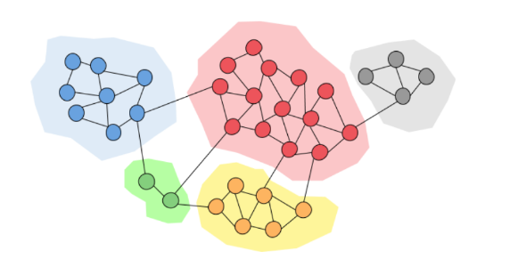

## 7. Comunità nelle reti

Le comunità sono una proprietà di tante reti reali: una comunità all'interno di una rete contiene dei nodi densamente connessi. I link tra nodi in comunità differenti sono poco frequenti. 

### 7.1 Introduzione

Possiamo pensare ai collegamenti tra nodi come un concetto di amicizia. Granovetter (1973) individuò due diverse prospettive di di amicizia:

* Amicizia strutturale: l'amicizia si distribuisce in diverse parti della rete 
* Amicizia interpersonale: l'amicizia tra due persone può essere forte o debole

Un ruolo fondamentale è quello delle *chiusure triadiche*: se due persone in una rete hanno un amico in comune, allora c'è una più alta probabilità che questi diventino amici. 

Spieghiamo il concetto di amicizia forte e debole:

* Gli archi all'interno di una struttura (es. una chiusura triadica) sono socialmente forti
* Gli archi lunghi che connettono diverse parti della rete sono socialmente deboli 

Inoltre, focalizzandoci sull'informazione che naviga nella rete, possiamo dire che:

* Gli archi lunghi consentono di ottenere informazioni da parti diverse di una rete
* Gli archi all'interno di una struttura sono ridondanti in termini di accesso all'informazione

Osservazione: la perdita di una connessione forte non mi fa perdere informazione all'interno di una rete, al contrario, la perdita di una connessione debole causa perdita di informazione. 

Osservazione: una chiusura triadica ha un alto coefficiente di clustering. Se $B$ e $C$ hanno un amico $A$ in comune, allora: 

* $B$ verosimilmente incontrerà $C$ ($A$ spende tempo con entrambi)
* $B$ e $C$ credono l'uno nell'altro poiché hanno un amico in comune
* $A$ è incentivato a legare $B$ e $C$

Ad esempio, uno studio empirico di Bearman e Moody dimostra che le ragazze teenager con basso coefficiente di clustering sono più inclini al suicidio. 

#### 7.1.1 Arco ponte e ponte locale 

Circa 1:25:00 

